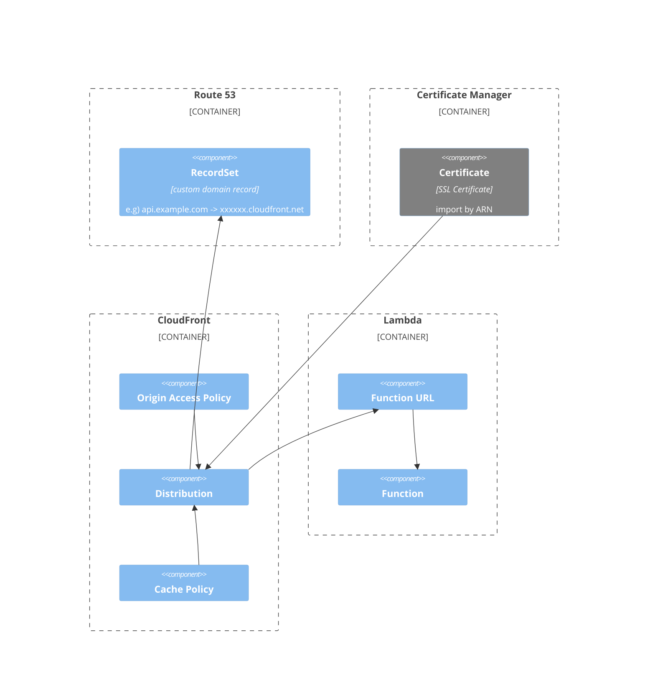

lambda-function-urls-with-custom-domain
===

# Resources

## Lambda::Function

- Runtime: `go1.x`
- Timeout: 10 sec
- Memory: 128 MB
- Operation:
  - returns simple JSON response

### AWS::Lambda::Url

## CloudFront::Distribution

### CloudFront::OriginRequestPolicy

- HeaderBehavior: none

### AWS::CloudFront::CachePolicy

- DefaultTTL: 120
- MaxTTL: 300
- MinTTL: 1

## Route53:RecordSet

- Name: api.example.com (e.g)
- Type: `A`
- AliasTarget: xxxxxxxxxxx.cloudfront.net

# Components



# Usage

## Create .env file and load

```bash
cp .env.sample .env
```

Fix values to your own.

```bash
source .env
```

## Build lambda function

```bash
make build
```

## Deploy

```bash
cdk synth
```

```bash
cdk deploy
```

## Call API

```bash
curl https://<your-own-custom-domain>
```

# Author

[michimani210](https://twitter.com/michimani210)
