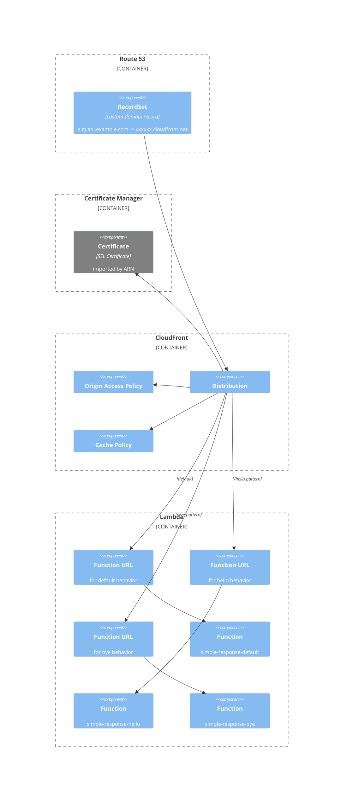

lambda-function-urls-with-custom-domain
===

This is an example implementation of calling a Lambda Function URL with a custom domain.

# Resources

## Lambda::Function

- Runtime: `go1.x`
- Timeout: 10 sec
- Memory: 128 MB
- Operation:
  - returns simple JSON response

In this example, create three Lambda Functions for
- default behavior
- `/hello` path pattern behavior
- `/bye` path pattern behavior

### AWS::Lambda::Url

- Function URL for each Lambda Function

## CloudFront::Distribution

### CloudFront::OriginRequestPolicy

- HeaderBehavior: none

### AWS::CloudFront::CachePolicy

- DefaultTTL: 120
- MaxTTL: 300
- MinTTL: 1

## Route53:RecordSet

- Name: api.example.com (e.g)
- Type: `A`
- AliasTarget: xxxxxxxxxxx.cloudfront.net

# Components



# Usage

## Create .env file and load

```bash
cp .env.sample .env
```

Fix values to your own.

```bash
source .env
```

## Build lambda function

```bash
make build
```

## Deploy

```bash
cdk synth
```

```bash
cdk deploy
```

## Call API

### Default behavior

```bash
curl https://<your-own-custom-domain>
```

You will get response like following.

```json
{
  "requestId": "19578134-de4f-4ed3-b4d3-480d36c2b5b7",
  "message": "Default Response",
  "time": "2023-02-15T15:12:07.417743679Z"
}
```

### Hello behavior

```bash
curl https://<your-own-custom-domain>/hello
```

You will get response like following.

```json
{
  "requestId": "eaec7fcf-ea9a-433c-ad63-3be2af4c69d0",
  "message": "Hello Lambda!",
  "time": "2023-02-15T15:14:37.214472546Z"
}
```

### Bye behavior

```bash
curl https://<your-own-custom-domain>/bye
```

You will get response like following.

```json
{
  "requestId": "45badc8d-8e1d-40a2-a8b2-d5ed4c654f33",
  "message": "Goodbye Lambda!",
  "time": "2023-02-15T15:15:05.749203554Z"
}
```

# Author

[michimani210](https://twitter.com/michimani210)
