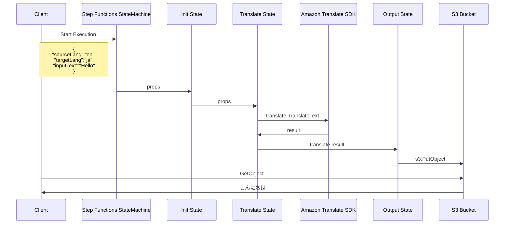

step-functions-with-sdk-integration
===

This is an example implementation of building a StepFunctions state machine that translates text using some AWS SDK integration.

# Resources

## S3::Bucket

- For placing objects resulting from translation.

## Logs::LogGroup

- For storing the execution logs of the StepFunctions state machine.

## StepFunctions::StateMachine

- State machine that translates a text.
- Use following AWS SDK integration:
  - Translate: translateText
  - S3: putObject

# Architecture



# Usage

## Set name of S3 Bucket for environment variable

```bash
export OUTPUT_BUCKET_NAME='output-bucket-name'
```

## Test

```bash
go test .
```

## Deploy

```bash
cdk synth
```

```bash
cdk deploy
```

## Start state machine manually

```bash
aws stepfunctions start-execution \
--state-machine-arn $(
  aws stepfunctions list-state-machines \
  --query "stateMachines[?name=='sdk-integration-example-state-machine'].stateMachineArn" \
  --output text) \
--input file://testdata/statemachine_input.json
```

Check result.

```bash
aws s3 cp "s3://${OUTPUT_BUCKET_NAME}/translate-result" -

# "こんにちは。これは、Go 言語で AWS CDK を使用するための実装例です。"
```

# Author

[michimani210](https://twitter.com/michimani210)